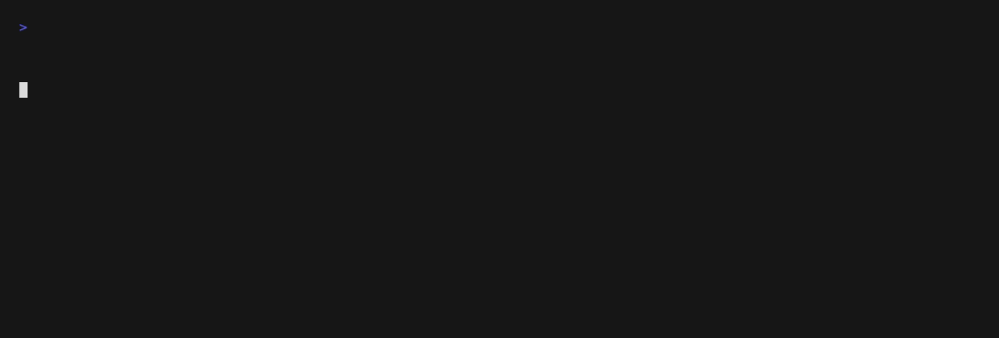
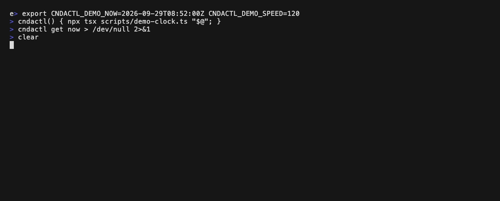

# cndactl

`cndactl` is a command line tool for browsing Cloud Native Days Austria information from the terminal.

## Features

- Browse conference sessions from Sessionize, including room and start time
- See the current or upcoming talk in every room
- Follow a live updating view with a progress bar for the running talk
- Explore speakers, bios, and speaker links
- List core event links such as tickets, venue, and website
- Open tickets, website, venue, and speaker URLs in the browser

## Demo

What is on right now, in every room:



`cndactl watch` keeps that view up to date and shows how much of the running talk is left:



Both recordings are scripted with [vhs](https://github.com/charmbracelet/vhs) and use a faked clock, so they show the conference in full swing. To re-record them:

```bash
vhs demo/get-now.tape
vhs demo/watch.tape
```

The tapes call `scripts/demo-clock.ts`, which runs the CLI at a fixed point in time (`CNDACTL_DEMO_NOW`) and optionally faster than real time (`CNDACTL_DEMO_SPEED`), so a few seconds of recording cover half an hour of conference.

## Requirements

- Node.js 20 or newer
- Network access to the public Sessionize event feed

## Quick Start

Run without installing globally:

```bash
npx cndactl get sessions
```

Or with pnpm:

```bash
pnpm dlx cndactl get sessions
```

If you cloned the repository locally:

```bash
pnpm install
pnpm run build
node dist/cli.js get sessions
```

For a persistent local command name:

```bash
pnpm run link
cndactl get sessions
```

## Commands

```bash
cndactl get sessions
cndactl get sess
cndactl describe session 1119590
cndactl describe sess 1119590
cndactl get now
cndactl get now --room "Room 4"
cndactl watch
cndactl watch --room 6 --interval 5
cndactl get speakers
cndactl get spk
cndactl describe speaker "Alex Example"
cndactl describe spk "Alex Example"
cndactl get links
cndactl get sessions --no-cache
cndactl open tickets
cndactl open website
cndactl open event venue
cndactl open speaker "Alex Example" linkedin
```

## Command Reference

`cndactl get sessions`

- Lists sessions from the configured Sessionize feed, each with its room and start time.

`cndactl describe session <query>`

- Shows a single session by exact id or partial title match.

`cndactl get now`

- Shows the talk currently running in every room, or the next one when a room is between slots.
- Adds the remaining time for a running talk and a countdown for an upcoming one.
- `--room <room>` limits the output to one room. The filter is forgiving: `--room "Room 4"`, `--room room4`, and `--room 4` all work.
- Also available as `cndactl get current`.

`cndactl watch`

- Live updating version of `cndactl get now`, with a progress bar showing how much of the running talk is left.
- Redraws every second; change that with `--interval <seconds>`.
- `--room <room>` limits the view to one room.
- Runs in the alternate screen buffer and restores the terminal on `Ctrl+C`. When the output is piped or redirected, it prints a single frame instead.

`cndactl get speakers`

- Lists speakers from the configured Sessionize feed together with accepted talk counts.

`cndactl describe speaker <query>`

- Shows a single speaker by exact id or partial name match.
- Attempts to render the speaker profile picture using terminal image protocols (for example iTerm2/Kitty support), then falls back to text-only details when rendering is unavailable.

`cndactl get links`

- Lists built-in conference links such as website, tickets, venue, and YouTube.

Short aliases are also available: `cndactl get sess`, `cndactl describe sess <query>`, `cndactl get spk`, and `cndactl describe spk <query>`.

`cndactl open tickets`

- Opens the ticket page in the default browser.

`cndactl open website`

- Opens the main Cloud Native Days Austria website.

`cndactl open event <linkId>`

- Opens a configured event link such as `venue`, `sessions`, `team`, or `youtube`.

`cndactl open speaker <speakerQuery> <linkType>`

- Opens a speaker link such as `linkedin`, `blog`, `sessionize`, or `company-website`.

`cndactl ... --no-cache`

- Bypasses local Sessionize cache for that run and always fetches fresh data.

## Data Source

The CLI reads from the Sessionize `All` endpoint for event key `7o54a33i`:

`https://sessionize.com/api/v2/7o54a33i/view/All`

The app currently trusts that this feed is already configured to expose the intended public speaker and session set.

Sessionize returns session times in UTC. All times are displayed in the event time zone `Europe/Vienna`, so they match the printed schedule on site regardless of where you run the CLI.

Sessionize data is cached locally in the operating system cache directory (for example `~/.cache/cndactl` on Linux/macOS, `%LOCALAPPDATA%\\cndactl` on Windows). The cache is refreshed every 30 minutes by default.

You can change the refresh interval with `CNDACTL_SESSIONIZE_CACHE_TTL_MINUTES`:

```bash
CNDACTL_SESSIONIZE_CACHE_TTL_MINUTES=10 cndactl get sessions
```

If cache reads/writes fail, `cndactl` automatically falls back to direct Sessionize fetches.

